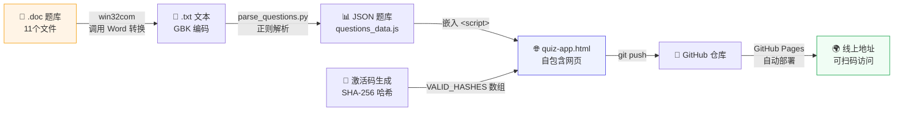
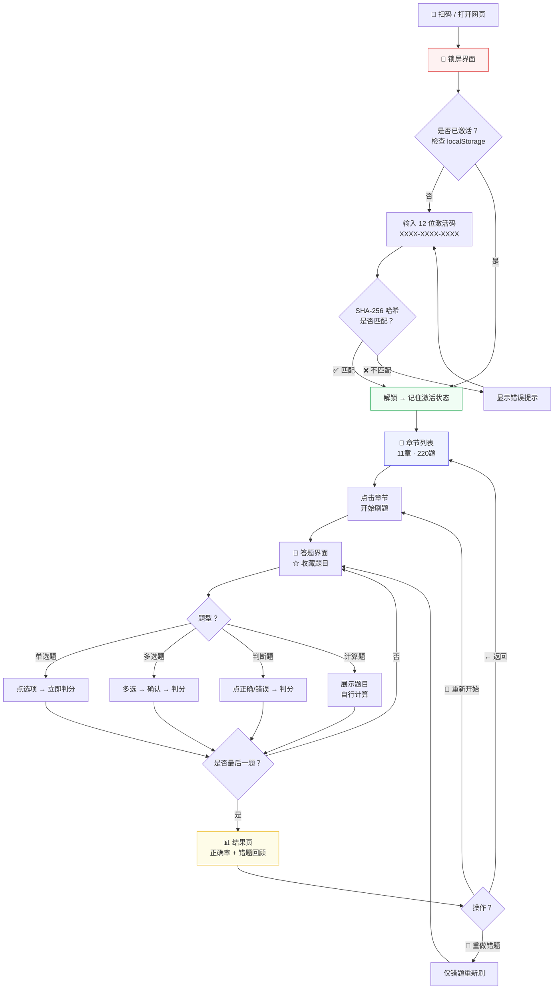
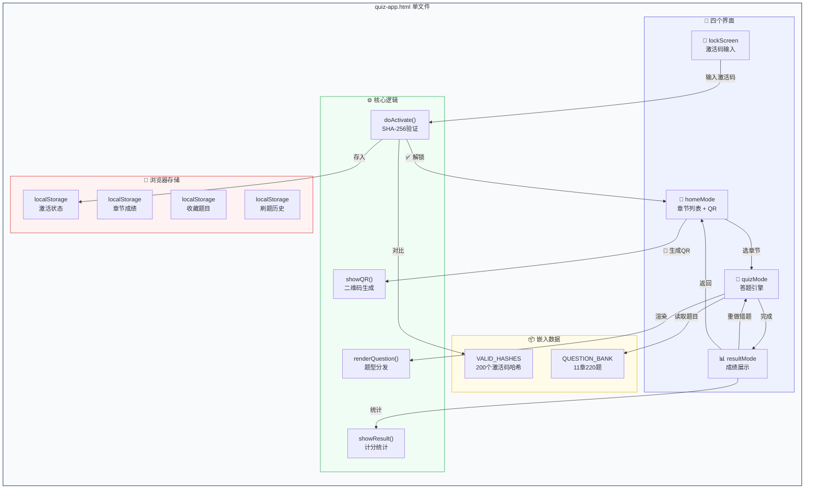
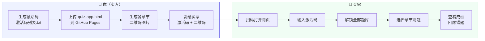

# 财务管理刷题网页版 — 完整制作流程

## 一、项目概述

将一个包含 11 章 220 道财务管理题目的题库（原为 `.doc` 文件），制作为可通过二维码扫码刷题的自包含网页，并内置激活码系统用于售卖。

- **线上地址**：`https://u1-1-ai.github.io/quiz/quiz-app.html`
- **GitHub 仓库**：`https://github.com/U1-1-AI/quiz`
- **功能亮点**：按章节刷题 · 收藏题目 · 刷题历史记录 · 错题重做 · 二维码直达章节

---

## 流程图

### 1. 整体制作流水线



### 2. 买家使用流程



### 3. quiz-app.html 内部结构



### 4. 售卖与部署流程



---

## 二、最终文件结构

```
新建文件夹 (2)/
├── quiz-app.html          ★ 主文件：自包含网页（题库+激活锁+刷题引擎）
├── 激活码列表.txt          激活码清单（200枚，用于发给买家）
├── parse_questions.py      题库解析脚本（.doc → JSON）
├── questions_data.js       题库数据（JS格式，供嵌入HTML）
├── convert_docs.py         .doc 转 .txt 脚本
├── 部署指南.md             微信小程序+后端部署说明
│
├── 作业库/                 ★ 原始 .doc 题目文件（11个）
├── 作业库_txt/             .doc 转换后的 .txt 文件
│
├── miniprogram/            微信小程序源码（备用）
│   ├── app.js / app.json / app.wxss
│   ├── pages/login/        登录+激活码页
│   ├── pages/chapters/     章节列表页
│   ├── pages/quiz/         刷题页
│   ├── pages/result/       结果页
│   └── utils/questions.js  题库数据
│
└── backend/                Flask 后端认证服务器（备用）
    ├── server.py
    └── requirements.txt
```

---

## 三、完整制作步骤

### 步骤 1：将 .doc 题库转换为 .txt

原始题库是 11 个 `.doc` 文件，存放在 `作业库/` 目录下，文件名为中文（如 `作业一 财务管理总论.doc`）。

使用 Python `win32com` 调用本机 Microsoft Word 进行转换：

```python
import os
import win32com.client

folder = r'作业库路径'
outdir = r'作业库_txt路径'
os.makedirs(outdir, exist_ok=True)

word = win32com.client.Dispatch('Word.Application')
word.Visible = False
word.DisplayAlerts = 0

for fname in os.listdir(folder):
    if fname.lower().endswith('.doc'):
        fpath = os.path.join(folder, fname)
        txt_name = os.path.splitext(fname)[0] + '.txt'
        txt_path = os.path.join(outdir, txt_name)
        doc = word.Documents.Open(fpath)
        doc.SaveAs(txt_path, FileFormat=7)  # 7 = 纯文本格式
        doc.Close()

word.Quit()
```

**注意**：需要本机安装 Microsoft Word，且 .doc 文件编码为 GBK。

---

### 步骤 2：解析 .txt 提取结构化题目

运行 `parse_questions.py`，将 .txt 中的题目解析为 JSON 格式。

**题目格式识别**：

| 题型 | 标识 | 选项 | 答案格式 |
|------|------|------|----------|
| 单选题 | `一、单选题` | A/B/C/D | `C` |
| 多选题 | `二、多选题` | A/B/C/D/E | `ABCD` |
| 判断题 | `三、判断题` | 无选项 | `正确` / `错误` |
| 计算题 | `四、计算题` | 无选项 | 仅展示题目文本 |

**关键解析逻辑**：
1. 按行读取，识别 `一、单选题` `二、多选题` `三、判断题` `四、计算题` 等标题切换题型
2. 识别 `1、题目内容` 开头的行作为题目开始
3. 识别 `A、选项内容` 格式的行作为选项
4. 处理分行选项（如 `A、` 后换行再跟内容）
5. 识别 `正确答案：X` 作为答案

**输出格式**：
```json
{
  "作业一 财务管理总论": {
    "name": "作业一 财务管理总论",
    "questions": [
      {
        "q": "经济繁荣时期，不应该选择的财务战略是（    ）",
        "o": ["扩充厂房设备", "增加存货", "减少投资", "提高产品价格"],
        "a": 2,
        "type": "single"
      },
      {
        "q": "企业财务管理目标中，同时考虑资金时间价值和投资风险因素的是",
        "o": ["产值最大化", "利润最大化", "每股收益最大化", "企业价值最大化"],
        "a": 3,
        "type": "single"
      }
    ],
    "count": 29
  }
}
```

解析结果写入 `questions_data.js`：
```javascript
const QUESTION_BANK = { ... };
```

**最终解析结果**：11 章，220 题（单选 55 + 多选 43 + 判断 64 + 计算 58）

---

### 步骤 3：构建自包含网页 quiz-app.html

`quiz-app.html` 是单文件网页应用，包含 HTML + CSS + JS + 题库数据。

#### 3.1 嵌入题库数据

将 `questions_data.js` 的内容直接嵌入 `<script>` 标签中：

```html
<script>
const QUESTION_BANK = {
  "作业一 财务管理总论": { ... },
  "作业二（1）货币时间价值": { ... },
  ...
};
</script>
```

#### 3.2 激活码锁屏

页面加载时先显示锁屏界面，要求输入激活码。

```javascript
// 激活码验证流程
function doActivate() {
  const raw = input.value.replace(/-/g, '').toUpperCase();  // 去掉横线，转大写
  // SHA-256 哈希
  crypto.subtle.digest('SHA-256', encoder.encode(raw))
    .then(hashBuffer => {
      const hashHex = Array.from(new Uint8Array(hashBuffer))
        .map(b => b.toString(16).padStart(2, '0')).join('');
      if (VALID_HASHES.includes(hashHex)) {
        localStorage.setItem('quiz_activated', raw);  // 记住激活状态
        showHomePage();
      }
    });
}
```

**激活码生成**：使用确定性算法生成 200 个 12 位激活码（排除易混淆字符 0O1I）：

```python
import hashlib

chars = 'ABCDEFGHJKLMNPQRSTUVWXYZ23456789'

for i in range(200):
    seed = f'quiz_seed_{i:04d}'
    rng = hashlib.sha256(seed.encode()).digest()
    code = ''.join(chars[rng[j] % len(chars)] for j in range(12))
    formatted = code[:4] + '-' + code[4:8] + '-' + code[8:12]
    # 保存 formatted 给买家，SHA-256(formatted去掉横线) 存到 HTML
```

#### 3.3 UI 布局

页面包含四种模式：

| 模式 | ID | 说明 |
|------|-----|------|
| 锁屏 | `lockScreen` | 激活码输入界面 |
| 首页 | `homeMode` | 章节列表 + 二维码生成 |
| 刷题 | `quizMode` | 答题界面 |
| 结果 | `resultMode` | 成绩 + 错题回顾 |

#### 3.4 章节列表页（首页）

从 `QUESTION_BANK` 读取所有章节，显示为卡片列表：

- 每张卡片显示：章节名、题目数、题型标签（单选/多选/判断/计算）
- 点击卡片：进入刷题模式
- 点击 📱 图标：生成该章节的二维码

#### 3.5 刷题引擎

**题型支持**：

| 题型 | type | 交互方式 |
|------|------|----------|
| 单选题 | `single` | 点击选项 → 立即显示对错 → 正确自动前进 |
| 多选题 | `multi` | 点击选项多选 → 点「确认答案」→ 显示对错 |
| 判断题 | `judge` | 点击「正确」或「错误」→ 显示对错 |
| 计算题 | `calc` | 仅展示题目 + 提示自行计算 |

**核心状态变量**：
```javascript
let quizQuestions = [];      // 当前章节的题目数组（保持原顺序）
let currentIndex = 0;        // 当前题目索引
let userAnswers = [];        // 用户答案记录
let isRevealed = false;      // 是否已揭示答案
```

**导航**：
- 「跳过」按钮：未作答时可用
- 「下一题」按钮：作答后出现
- 正确自动前进（单选/判断）：800ms 后自动跳下一题
- 手动打乱 🔀：随机重排题目顺序

**计分逻辑**：
- 单选题/判断题：用户选择 === 正确答案 → 正确
- 多选题：用户选中集合 === 正确答案集合 → 正确
- 计算题：不参与计分
- 跳过：不计入正确/错误

#### 3.6 结果页

- 正确率百分比（大号数字）
- 统计卡片：正确数、错误数、跳过数、计算题数
- 错题/未答回顾列表：显示题目 + 你的答案 + 正确答案
- 「重做错题」按钮
- 「重新开始」按钮
- 「返回章节列表」按钮

#### 3.7 二维码生成

使用 `api.qrserver.com` 免费 API 生成二维码：

```javascript
function showQR(chName) {
  const hostUrl = document.getElementById('baseUrl').value.trim();
  const fullUrl = hostUrl + '#chapter=' + encodeURIComponent(chName);
  const qrApiUrl = 'https://api.qrserver.com/v1/create-qr-code/?size=300x300&data='
    + encodeURIComponent(fullUrl);
  // 显示在弹窗中
}
```

每个章节生成独立的二维码，扫码直接进入该章节的刷题界面。

#### 3.8 收藏题目功能

刷题时点击 ☆ 按钮收藏当前题目，用于后续针对性查漏补缺。

**存储结构**（localStorage key: `quiz_bookmarks`）：
```javascript
{
  "第一章  总   论|||5": {
    "chapter": "第一章  总   论",
    "index": 5,
    "q": "成本会计最基本的职能是...",
    "type": "single",
    "time": "2026-06-10T12:00:00.000Z"
  }
}
```

**UI 交互**：
- 刷题顶部栏 ☆ 按钮：未收藏灰色 ☆ → 点击变金色 ★
- 首页「收藏题目」折叠区：按时间倒序排列，点击跳转到对应题目
- 每项右侧 × 可删除单条收藏

**关键函数**：
| 函数 | 作用 |
|------|------|
| `toggleBookmark()` | 切换当前题目的收藏状态 |
| `updateBookmarkBtn()` | 刷新 ☆ 按钮状态（切换题目时调用） |
| `renderBookmarks()` | 在首页渲染收藏列表 |
| `goToBookmark(key)` | 从收藏列表跳转到指定题目 |
| `removeBookmark(key)` | 删除单条收藏 |

#### 3.9 刷题历史记录

每次完成一章刷题后，自动记录时间、章节、得分到 localStorage。

**存储结构**（localStorage key: `quiz_history_v2`）：
```javascript
[
  {
    "chapter": "第一章  总   论",
    "correct": 20,
    "total": 28,
    "quizTotal": 28,
    "pct": 71,
    "time": "2026-06-10T12:30:00.000Z"
  },
  ...
]
```

**UI 交互**：
- 首页「刷题历史」折叠区：按时间倒序排列
- 每项显示：章节名、日期时间、正确数/总答题数、百分比
- 得分颜色：≥80% 绿色，60-79% 橙色，<60% 红色
- 点击历史条目直接进入该章节刷题
- 「清除历史」按钮可清空全部记录

**关键函数**：
| 函数 | 作用 |
|------|------|
| `recordHistory()` | 在 `showResult()` 中调用，保存本次成绩 |
| `renderHistory()` | 在首页渲染历史列表 |
| `clearHistory()` | 清除全部历史记录 |

#### 3.10 托管地址自动检测

**问题**：二维码生成需要知道页面线上 URL，本地打开时无法自动获取。

**解决方案**（`loadHostUrl()` 三级优先级）：
1. 有 localStorage 缓存 → 直接用
2. 在线打开（`https://...`）→ 自动获取当前 URL
3. 本地打开（`file://`）→ 兜底填入已知线上地址

```javascript
function loadHostUrl() {
  const saved = localStorage.getItem(URL_KEY) || '';
  if (saved) return saved;
  if (window.location.protocol.startsWith('http')) {
    return window.location.href.replace(/#.*$/, '').replace(/\?.*$/, '');
  }
  return 'https://u1-1-ai.github.io/quiz/quiz-app.html';  // 兜底
}
```

#### 3.11 内联选项处理

**问题**：.doc 转 .txt 后，部分题目的选项会合并在同一行：
```
A.C+M      B. C+V        C.V+M         D. C+V+M
```

**解析器需支持拆分内联选项**：
```python
def split_inline_options(text):
    """将包含多个选项的单行拆分为独立选项"""
    parts = re.split(r'\s+(?=[A-E][.、．])', text)
    result = []
    for part in parts:
        match = re.match(r'^[A-E][.、．]\s*(.+)', part.strip())
        if match:
            result.append(match.group(1).strip())
    return result
```

---

### 步骤 4：部署到 GitHub Pages

1. 在 GitHub 创建仓库 `quiz`
2. 上传 `quiz-app.html`
3. 仓库 Settings → Pages → Source 选 `main` → Save
4. 获得地址：`https://u1-1-ai.github.io/quiz/quiz-app.html`

**网页版无需服务器**，全部逻辑在浏览器中运行。

---

### 步骤 5：管理售卖

#### 激活码分发

`激活码列表.txt` 包含 200 个激活码，格式：

```
  1. B3Z5-MKK2-5XUL
  2. 2FXZ-HPMR-WGTV
  3. 4PGC-UPGM-LS3L
 ...
200. KTU5-BTUG-KJGW
```

每个买家给一个码 + 网页地址。

#### 扩充激活码

修改 `parse_questions.py` 中的生成数量，重新生成哈希到 HTML：

```python
for i in range(500):  # 改为 500
    ...
```

---

## 四、日常运营

### 更新题库
1. 替换 `作业库/` 中的 .doc 文件
2. 重新运行转换 → 解析 → 嵌入 → 推送
3. 网页自动更新（GitHub Pages 自动部署）

### 查看使用数据
纯离线版无法追踪使用情况。需要数据时部署后端 `backend/server.py`。

### 定价建议
- 单章：¥9.9
- 全 11 章：¥49.9 ~ ¥99.9
- 每个激活码 = 一个买家

---

## 五、技术要点总结

| 要点 | 方案 |
|------|------|
| 题库来源 | .doc → win32com 转 .txt → Python 解析 → JSON |
| 选项处理 | 支持逐行解析 + 内联拆分（`A.xxx B.xxx` 格式） |
| 答案匹配 | 支持嵌入答案（`正确答案：X`）或独立答案文件匹配 |
| 前端框架 | 纯 HTML/CSS/JS，无依赖 |
| 激活码验证 | SHA-256 哈希比对，离线可用 |
| 题库存储 | 嵌入 HTML 的 JS 对象 |
| 托管 | GitHub Pages（免费） |
| 二维码 | api.qrserver.com 免费 API |
| 题型 | 单选/多选/判断/计算 四种 |
| 出题顺序 | 保持原始章节顺序，可手动打乱 |
| 收藏题目 | localStorage + ☆ 按钮，首页可查看/跳转 |
| 刷题历史 | localStorage 记录每次成绩，首页可查看历次记录 |
| 托管地址 | 三级兜底：缓存 → 在线检测 → 硬编码线上 URL |
| 移动适配 | 响应式设计，手机/平板/桌面均可 |

---

## 六、常见问题

**Q: 一个激活码能被多人使用吗？**
离线版无法阻止。建议给每个买家分配不同激活码。如需严格一码一用，需部署后端服务器。

**Q: 如何防止买家直接分享 HTML 源码？**
题库数据嵌入在 HTML 中，技术水平高的用户可提取。如需更高安全级别，可部署后端，题库通过 API 按需加载。

**Q: 二维码扫不出来怎么办？**
URL 过长可能导致二维码过密。目前每个章节独立生成二维码，URL 长度约 80-100 字符，易于扫描。

**Q: 如何更新线上版本？**
修改 `quiz-app.html` → `git commit` → `git push` → GitHub Pages 自动更新（约 30 秒）。


更新题库后，打开github将quiz-app.html 重新部署到 GitHub
  Pages。步骤：

  1. 把修改后的文件推送到 GitHub 仓库

  2. 在仓库 Settings → Pages 里确认已开启

  3. 访问 https://你的用户名.github.io/仓库名/quiz-app.html

     
